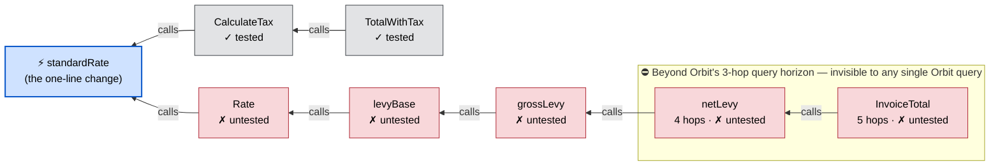
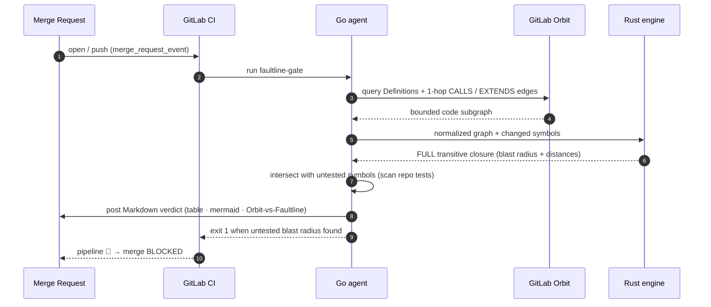
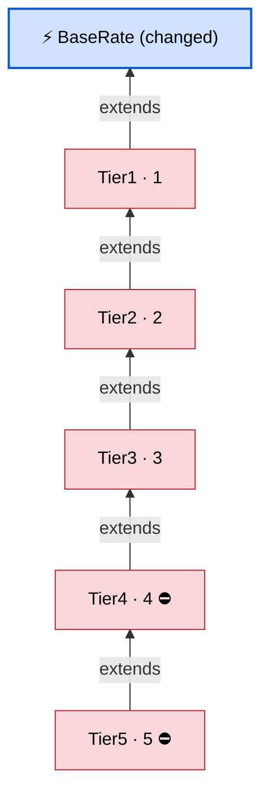

<div align="center">

# 🪨 Faultline

### Transitive change-impact governance for GitLab merge requests — built on [GitLab Orbit](https://about.gitlab.com/gitlab-orbit/).


**Orbit can _describe_ a change's blast radius. Faultline makes Orbit _enforce_ it — Code Owners for the blast radius, not the diff.**

</div>

---

Faultline computes the **complete transitive set of definitions affected** by a merge request's changes — over GitLab Orbit's `CALLS` *and* `EXTENDS` graph — intersects it with the impacted code that **has no test coverage**, and **fails the pipeline (blocks the merge)** when an untested blast radius is found.

A one-line tweak to a `standardRate` helper looks harmless, passes CI, and gets approved on the diff. Faultline shows it silently reaches an **untested function five calls away** — and stops it.



> 🔵 changed · 🔴 impacted **and untested** · ⬜ impacted but tested · the boxed nodes are deeper than Orbit's query DSL can reach.

## The moat: a graph primitive Orbit doesn't expose

Orbit's query DSL can traverse the `CALLS` graph — but its `traversal` query type **hard-caps `max_hops` at 3**, and there is **no transitive-closure / variable-depth reverse-reachability operator** (its only depth operator, `path_finding`, returns a single point-to-point shortest path). Probe the live endpoint yourself:

```console
$ curl -s -X POST "$GITLAB/api/v4/orbit/query" -H "Authorization: Bearer $TOKEN" \
    -d '{"query":{"query_type":"traversal", ... "relationships":[{"type":"CALLS","max_hops":4}]}}'
{"code":"compile_error","message":"schema violation: 4 is greater than the maximum of 3 at /relationships/0/max_hops"}
#   max_hops: 3 → 200 OK     max_hops: 4 → rejected
```

Orbit's homepage markets blast radius *"regardless of depth ... in a single tool call,"* but the platform literally refuses the query past 3 hops. **Faultline adds the capability Orbit lacks:** a deterministic engine that computes the *whole* transitive closure — the set, not a path; complete, not capped.

## How it works



The **Rust engine** is the moat: a pure, deterministic BFS over reverse impact edges → the complete caller/subtype set with shortest distances (`O(V+E)`, cycle-safe). The **Go agent** is the platform glue: it talks to Orbit, scans for test coverage, renders, posts, and gates. **No model is in the compute path** — same inputs, byte-identical verdict, every run.

## Live, on a real merge request

On [a real MR that raises a tax rate by one line](https://gitlab.com/anbuchelvanganesan.cse2024-group/faultline-demo/-/merge_requests/1), the pipeline goes **red** and Faultline posts:

> ⚠️ **7 definitions transitively affected** — max depth **5**, beyond Orbit's 3-hop query cap.
> **🔭 Orbit reaches at most 5 of 7**; `netLevy` (4 hops) and `InvoiceTotal` (5 hops) are invisible to any single Orbit query.
> 🚦 **Untested blast radius — 5 impacted symbols with no test coverage → GATE FAILED, merge blocked.**

## It covers inheritance, not just calls

Faultline folds Orbit's `EXTENDS` edges (inheritance / interface impl / struct embedding) into the same closure — so changing a base type ripples through its **entire subtype chain**, also past the 3-hop cap (verified live):



## Why it's trustworthy, not AI slop

A gate that blocks merges must be **complete** and **deterministic**. Faultline is both, and it's proven:

- **A property test** (`analyze_matches_naive_reachability_on_random_graphs`) cross-checks the engine against an *independent* naive reachability oracle over **400 random graphs** — a machine-checked proof that the closure is the complete set, not a heuristic subset.
- **110 deterministic tests total** (Rust engine 34 · Go agent 76). See [`faultline/CORRECTNESS.md`](faultline/CORRECTNESS.md) for the invariant, determinism guarantees, complexity, and honest limitations.

## Install (one CI job)

```yaml
# .gitlab-ci.yml  (+ a FAULTLINE_TOKEN CI variable, api scope)
include:
  - remote: 'https://gitlab.com/anbuchelvanganesan.cse2024-group/faultline/-/raw/main/ci/faultline-gate.yml'
```

```console
$ (cd faultline/engine && cargo test)   # 34 passed
$ (cd faultline/agent  && go test ./...) # 76 passed
```

## This repository

| Path | What |
|---|---|
| [`faultline/`](faultline/) | the tool — Rust engine, Go agent, AI Catalog agent, CI include, docs |
| `ripple-demo-go/` | demo target with the deep call + inheritance chains |

**Also published:** the `faultline-impact-reviewer` declarative agent is live in the **GitLab AI Catalog** (v1.1.0) as the always-on, in-platform companion to the CI engine.

## License

[MIT](LICENSE).
