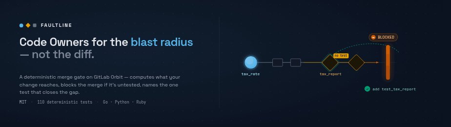
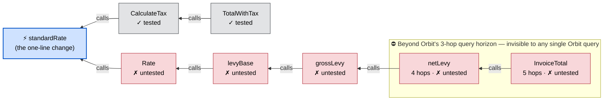
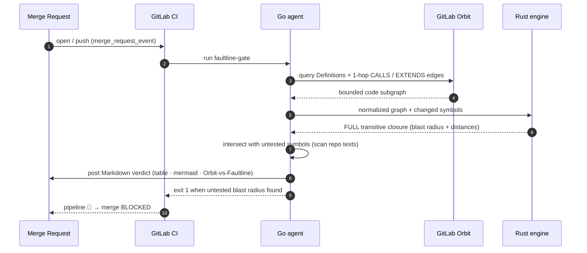
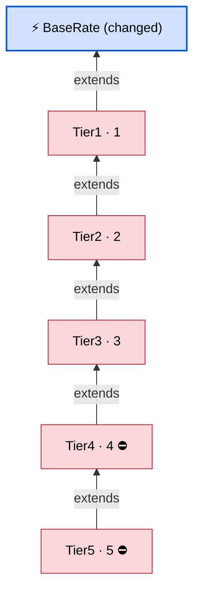

<div align="center">



# 🪨 Faultline

**A deterministic GitLab CI merge gate, built on [GitLab Orbit](https://about.gitlab.com/gitlab-orbit/), that blocks the _untested_ blast radius of a change — and names the one test that closes it.**


[**Try it live**](#try-it-live) • [**What makes it different**](#what-makes-it-different) • [**How it works**](#how-it-works) • [**Install**](#install-one-ci-job) • [**Why it's correct**](faultline/CORRECTNESS.md)

</div>

---

Code review shows you the diff. It does not show you the damage. A one-line change to a shared helper can break code five calls away that no reviewer opened — and when that code has no test, CI stays green the whole way down. Faultline asks Orbit what your change really reaches, **blocks the merge** when any of it is untested, and prescribes the single smallest test that closes the gap.

> GitLab built Orbit to answer one question — _"What breaks if I change this service?"_ — from _indexed facts, not inference_. Faultline takes that answer the last mile: it doesn't just _describe_ a change's blast radius, it **enforces** it. Code Owners for the blast radius, not the diff.

The previous GitLab AI Hackathon gave its Grand Prize to a project for letting you _"see the full impact of a change before you make it."_ Faultline is the next verb: it **enforces** that impact, and refuses the merge when the impact is untested.

**Proof, not adjectives:** 110 deterministic tests · the gate fired on **21 of 32** real [BugsInPy](https://github.com/soarsmu/BugsInPy) regressions · published in the **GitLab AI Catalog** · dogfooded on its own merge requests.

## Try it live

▶ **[Watch the 3-minute demo](https://youtu.be/zG4Gs0Y3a0Y)** — or get hands-on below.

Three real, public merge requests — open one and read the verdict on the red pipeline:

| Demo | What you'll see |
|---|---|
| [A one-line tax change, **blocked**](https://gitlab.com/anbuchelvanganesan.cse2024-group/faultline-demo/-/merge_requests/1) | untested impact five calls deep, and the one test to add |
| [One verdict across **Go + Python + Ruby**](https://gitlab.com/anbuchelvanganesan.cse2024-group/faultline-polyglot/-/merge_requests/1) | a shared rate bumped in three languages, one blast radius |
| [Faultline gating **its own repo**](https://gitlab.com/anbuchelvanganesan.cse2024-group/faultline/-/merge_requests/1) | dogfooded with the same `include:` we ship |

Or open the [**live interactive change-impact graph**](https://ripple-deep-demo-67d078.gitlab.io) — zoom, drag, and hover any function for its file and hop-distance.

## The problem, in one picture

A green CI run hides everything the diff didn't touch. Here is what one line actually reaches:



> 🔵 changed · 🔴 impacted **and untested** · ⬜ impacted but tested · the boxed nodes are deeper than Orbit's query DSL can reach.

## What makes it different

Blast-radius-on-Orbit is the most crowded lane in this hackathon, and the strongest entries are deterministic and genuinely deep. So neither _deterministic_ nor _sees the blast radius_ is the wedge. These are:

| | **Faultline** | Other Orbit blast-radius tools |
|---|---|---|
| **Acts** | **blocks the merge** on untested impact | post a comment / risk score |
| **The fix** | prescribes a **provably-minimal** test set — min vertex cut + exact Shapley, machine-checked | — |
| **Depth** | full transitive closure, **any depth** (demo: 5 hops) | bounded by a single `query_graph` |
| **Tests** | intersects the radius with **untested** code | don't look at tests |
| **Languages** | **Go · Python · Ruby**, one verdict | effectively Python |
| **Trust** | CI on Orbit's free API · **no model in the decision** · **fails closed** on a stale index | live Duo + hosted MCP (credits) |

The two we searched hard for prior art on and didn't find: **blocking the _untested_ slice** of the radius, and **prescribing the minimal cut** that closes it.

## The moat: a graph primitive Orbit doesn't expose

Orbit's query DSL can traverse the `CALLS` graph — but its `traversal` query type caps `max_hops` at 3, and there is **no transitive-closure / variable-depth reverse-reachability operator** (its only depth operator, `path_finding`, returns a single point-to-point shortest path). Probe the live endpoint yourself:

```console
$ curl -s -X POST "$GITLAB/api/v4/orbit/query" -H "Authorization: Bearer $TOKEN" \
    -d '{"query":{"query_type":"traversal", ... "relationships":[{"type":"CALLS","max_hops":4}]}}'
{"code":"compile_error","message":"schema violation: 4 is greater than the maximum of 3 at /relationships/0/max_hops"}
#   max_hops: 3 → 200 OK     max_hops: 4 → rejected
```

A single query gives bounded reach; a merge gate needs the **complete** set, where latency isn't the constraint. **Faultline adds the capability Orbit lacks:** a deterministic engine that composes the _whole_ transitive closure offline in CI — the set, not a path; complete, not capped.

## How it works



The **Rust engine** does the graph math as pure functions — a deterministic BFS over reverse impact edges for the complete caller/subtype set (`O(V+E)`, cycle-safe), plus the minimum cut and Shapley shares. The **Go agent** is the platform glue: it talks to Orbit, scans for test coverage, renders, posts, and gates. **No model is in the compute path** — same inputs, byte-identical verdict, every run.

## It prescribes the fix, not just the gap

Finding untested impacted code is the easy half. "Go write tests for all seven functions" is the answer nobody follows. So Faultline solves for the **fewest** test points that gate the entire change — a minimum vertex cut (max-flow / Menger), machine-checked against a brute-force oracle — and adds an **exact Shapley** split of the untested risk across the changed symbols. The verdict says _"add one test at `Rate`,"_ not _"go test everything."_ We looked for a shipping tool that does minimal-cut test prescription on a code graph and didn't find one.

## Does it catch real bugs?

We replayed the exact engine binary against real, reproduced regressions from [BugsInPy](https://github.com/soarsmu/BugsInPy) (a benchmark of 501 real Python bugs). Treating each fix as a merge request: on **21 of 32** analyzable regressions across `tornado` and `black`, the buggy change reaches untested code — the gate would have fired and named the minimal test. For example, a one-character `black` tokenizer fix silently reaches **5 untested functions** up the parse stack; Faultline prescribes **one** test (`parse_tokens`) to gate them all. The offline graph comes from a conservative static analyzer, so the number is a floor. Full methodology and verified call chains: [`faultline/empirical/RESULTS.md`](faultline/empirical/RESULTS.md).

## Honest by construction

A gate that blocks merges has to be sound, so Faultline is narrow on purpose:

- **It fails closed.** If Orbit's index is stale, partial, or still building, it returns a 🟡 _"can't vouch"_ verdict instead of a false green — the same instinct [GitLab's own indexer](https://gitlab.com/gitlab-org/orbit/knowledge-graph) uses when it refuses stale cleanup on a degraded re-index.
- **No model in the decision.** The verdict is a pure function of the graph. Determinism here isn't anti-AI — it's what makes the gate auditable. GitLab Duo enters only _after_ the block, to draft the prescribed test for a human to approve.
- **It refuses joins Orbit can't support.** No faked security→code or owner→code graph joins; it gates on the call graph Orbit makes trustworthy and states its soundness boundary out loud.

## It covers inheritance, not just calls

Faultline folds Orbit's `EXTENDS` edges (inheritance / interface impl / struct embedding) into the same closure — so changing a base type ripples through its **entire subtype chain**, also past the 3-hop cap (verified live):



## Install (one CI job)

```yaml
# .gitlab-ci.yml  (+ a FAULTLINE_TOKEN CI variable, api scope)
include:
  - remote: 'https://gitlab.com/anbuchelvanganesan.cse2024-group/faultline/-/raw/main/ci/faultline-gate.yml'
```

Gating is opt-in: by default the job comments and never blocks on first adoption. Set `FAULTLINE_GATE=N` to fail the pipeline above `N` untested-impacted symbols (`0` is zero-tolerance). A companion declarative agent is published to the **GitLab AI Catalog** (v1.1.0) as the always-on, in-platform companion to the CI engine.

## Proven correct

- A property test cross-checks the engine against an _independent_ naive reachability oracle over **400 random graphs** — a machine-checked proof that the closure is the complete set, not a heuristic subset (the cut and Shapley have their own brute-force oracles too).
- **110 deterministic tests** (Rust engine 34 · Go agent 76). See [`faultline/CORRECTNESS.md`](faultline/CORRECTNESS.md) for the invariant, determinism guarantees, complexity, and honest limitations.

```console
$ (cd faultline/engine && cargo test)   # 34 passed
$ (cd faultline/agent  && go test ./...) # 76 passed
```

## This repository

| Path | What |
|---|---|
| [`faultline/`](faultline/) | the tool — Rust engine, Go agent, AI Catalog agent, CI include, full docs |
| `ripple-demo-go/` | a demo target with deep call + inheritance chains |

The detailed engineering README, with four more diagrams, lives in [`faultline/`](faultline/README.md).

## License

[MIT](LICENSE).
